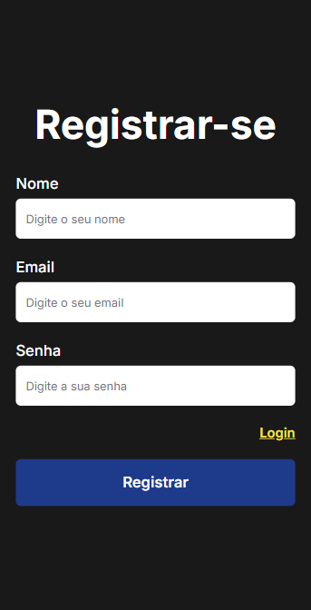
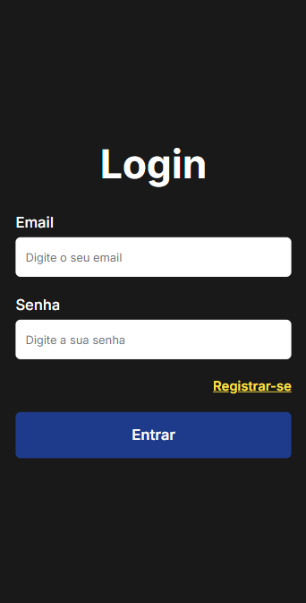
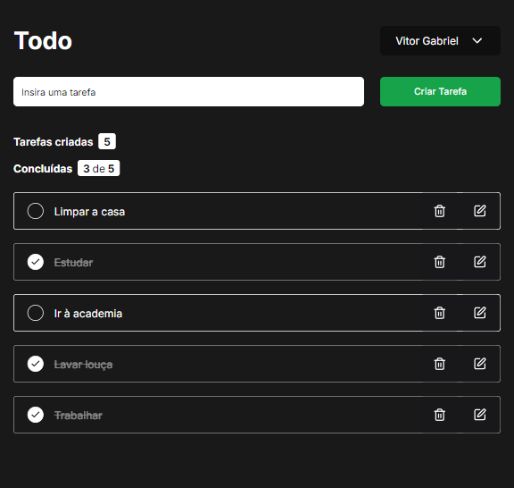

[NEXT__BADGE]: https://img.shields.io/badge/next%20js-000000?style=for-the-badge&logo=nextdotjs&logoColor=white
[PRISMA_ORM__BADGE]: https://img.shields.io/badge/Prisma-3982CE?style=for-the-badge&logo=Prisma&logoColor=white
[TYPESCRIPT__BADGE]: https://img.shields.io/badge/typescript-D4FAFF?style=for-the-badge&logo=typescript
[REACT__BADGE]: https://img.shields.io/badge/React-005CFE?style=for-the-badge&logo=react
[TAILWINDCSS__BADGE]: https://img.shields.io/badge/Tailwind_CSS-38B2AC?style=for-the-badge&logo=tailwind-css&logoColor=white
[SHADCN/UI__BADGE]: https://img.shields.io/badge/shadcn%2Fui-000000?style=for-the-badge&logo=shadcnui&logoColor=white
[ZOD__BADGE]: https://img.shields.io/badge/Zod-000000?style=for-the-badge&logo=zod&logoColor=3068B7
[REACT_HOOK_FORM__BADGE]: https://img.shields.io/badge/React%20Hook%20Form-%23EC5990.svg?style=for-the-badge&logo=reacthookform&logoColor=white
[PROJECT__BADGE]: https://img.shields.io/badge/📱Acessar_o_projeto-000?style=for-the-badge&logo=project
[PROJECT__URL]: https://todo-com-autenticacao.vercel.app/

<h1 align="center" style="font-weight: bold;">Todo com autenticação 📋</h1>

![next][NEXT__BADGE]
![prisma-orm][PRISMA_ORM__BADGE]
![react][REACT__BADGE]
![typescript][TYPESCRIPT__BADGE]
![shadcn/ui][SHADCN/UI__BADGE]
![tailwindcss][TAILWINDCSS__BADGE]
![zod][ZOD__BADGE]
![react-hook-form][REACT_HOOK_FORM__BADGE]

 <a href="#sobre">Sobre</a> • 
  <a href="#tecnologias">Tecnologias utilizadas</a> •
  <a href="#rotas">Rotas da aplicação</a>

    
    

    

<h2 id="sobre">📌 Sobre</h2>

Esse projeto consiste em uma lista de tarefas que possui um sistema de autenticação, nesse sistema o usuário pode se cadastrar e logo após realizar o login. O acesso à página de lista de tarefas só é possível se o usuário possuir um cadastro.

Dentro da página de lista de tarefas você pode adicionar as suas tarefas, e depois se for preciso, elas podem ser editadas, apagadas e/ou trocar o seu estado para completa ou incompleta.

Há também um menu de opções onde o usuário pode sair da sua conta cadastrada.

[![project][PROJECT__BADGE]][PROJECT__URL]

<h2 id='tecnologias'>🛠️ Tecnologias utilizadas</h2>

- **React** - Biblioteca front-end para construir interfaces visuais com JavaScript

- **Next** - Framework de desenvolvimento web baseado em React

- **TypeScript** - Linguagem de programação baseada em JavaScript, com a adição de tipagem estática

- **Next Auth** - Biblioteca de autenticação para o Next.js

- **Shadcn/ui** - Coleção de componentes reutilizáveis

- **TailwindCSS** - Framework de CSS

- **React Hook Form + Zod** - Combinação de bibliotecas para validar formulários

- **PrismaORM** - A sua função é facilitar e padronizar interações com bancos de dados

<h2 id="rotas">📍 Rotas da aplicação</h2>

| Rota                 | Descrição                  |
| -------------------- | -------------------------- |
| <kbd>/</kbd>         | página da lista de tarefas |
| <kbd>/register</kbd> | página de cadastro         |
| <kbd>/login</kbd>    | página de login            |
